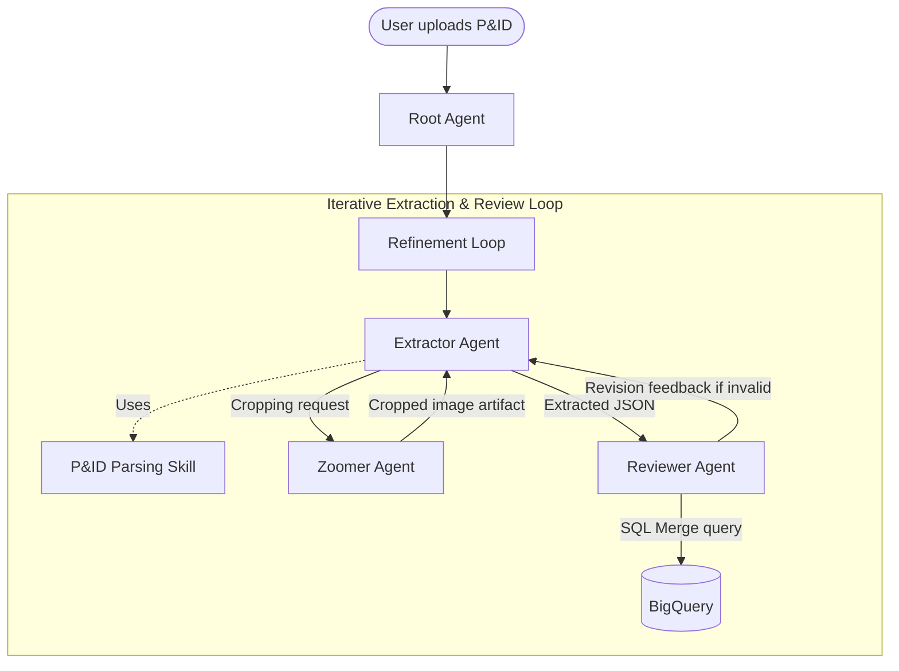

# Pandid: P&ID Digitization Agent Boilerplate

Pandid is a complete blueprint and boilerplate demonstrating how to build a highly intelligent process engineering agent using the **Agent Development Kit (ADK)** and **`agents-cli`**. 

This agent parses Piping and Instrumentation Diagrams (P&IDs) from images or PDFs, extracts physical components (valves, instruments, primary equipment) and process/electrical connections (pipes, signal lines), and streams them into BigQuery as structured node-and-edge graphs.

---

## 📂 Project Layout

*   **`pid-parsing-extraction/` (Modular Skill):** Contains the domain-specific extraction prompt instructions and reference guidelines (`SKILL.md`). In the ADK architecture, skills are decoupled modules that can be reused across different agents.
*   **`pid-agent/` (Agent Application):** The core application holding the multi-agent routing logic (`app/agent.py`), unit/integration tests (`tests/`), and environment configuration.



---

## 🚀 Beginner's Guide: Local Setup and Deployment

This guide assumes you have **no prior experience** with ADK or `agents-cli`, and limited familiarity with Google Cloud. Follow these step-by-step instructions to get the agent running locally and deployed to the cloud.

### 🛠️ Prerequisites

Before you start, you need to install two lightweight tools on your machine:

1.  **`uv` (fast Python tool and package manager):**
    *   *macOS/Linux:*
        ```bash
        curl -LsSf https://astral.sh/uv/install.sh | sh
        ```
    *   *Windows (PowerShell):*
        ```powershell
        powershell -ExecutionPolicy ByPass -c "irm https://astral.sh/uv/install.ps1 | iex"
        ```
2.  **Google Cloud SDK (`gcloud`):**
    *   Follow the [Official Google Cloud SDK installation instructions](https://cloud.google.com/sdk/docs/install) for your operating system.

---

### Step 1: Clone the Repository and Navigate
Clone this repository to your local machine and change directory into the project:
```bash
git clone https://github.com/sinaakhtar/pandid.git
cd pandid
```

---

### Step 2: Set Up Your Google Cloud Project

You need a Google Cloud Project with Billing enabled to use Gemini Enterprise Agent Platform and BigQuery. 

1.  Note your **Project ID**.
2.  **Login to Google Cloud in your terminal:**
    ```bash
    gcloud auth login
    ```
3.  **Set your active project:**
    ```bash
    gcloud config set project YOUR_PROJECT_ID
    ```
4.  **Configure Application Default Credentials (ADC):**
    This step is **critical**! It allows the ADK python library running locally to safely use your Google Cloud credentials to make Gemini API calls:
    ```bash
    gcloud auth application-default login
    ```

---

### Step 3: Create the Environment File (`.env`)

Environment variables tell the agent which project, location, and database dataset to target.

1.  Navigate into the `pid-agent` application folder:
    ```bash
    cd pid-agent
    ```
2.  Copy the template environment file:
    ```bash
    cp .env.example .env
    ```
3.  Open `.env` in any text editor and replace the placeholder values:
    *   `GOOGLE_CLOUD_PROJECT`: Set this to your **Project ID** from Step 2.
    *   `GOOGLE_CLOUD_LOCATION`: Leave as `us-central1` or set your preferred Vertex AI region.
    *   `BIGQUERY_DATASET_ID`: Set this to the BigQuery dataset where you want extracted tables to go (e.g., `pandid`). The agent will **automatically create this dataset** and its nodes/edges tables upon startup!

---

### Step 4: Run the Agent Locally

`agents-cli` is the unified command-line tool that handles package installation, code linting, evaluation, and running local developer playgrounds.

1.  **Install `agents-cli` globally:**
    ```bash
    uv tool install google-agents-cli
    ```
2.  **Initialize the developer skills & environment:**
    ```bash
    uvx google-agents-cli setup
    ```
3.  **Install project dependencies:**
    This command syncs all python packages required by the agent inside a local virtual environment:
    ```bash
    agents-cli install
    ```
4.  **Start the Local Playground:**
    Launch the interactive local web playground:
    ```bash
    agents-cli playground
    ```
    *   This will print a local URL (usually `http://localhost:8501`). Open it in your browser!
    *   In the web interface, select the **`app`** folder to connect to your agent.
    *   Try talking to your agent! Ask: *"Hello, what can you do?"* or upload a P&ID diagram and ask: *"Extract the process flow network from this diagram."*

---

### Step 5: Deploy the Agent to Google Cloud

Once you are happy with the agent's local behavior, you can deploy it to the cloud.

1.  **Prototyping vs Production Deployments:**
    By default, this boilerplate is in **Prototype Mode** (no cloud target is set).
2.  **Add a Deployment Target:**
    If you want to deploy the agent as a fully-managed API on Google Cloud, enhance the project scaffolding to add **Agent Runtime** (Vertex AI Agent Runtime) or **Cloud Run**:
    ```bash
    # Add Agent Runtime deployment support
    agents-cli scaffold enhance . --deployment-target agent_runtime
    ```
3.  **Deploy:**
    Trigger the deployment pipeline with a single command:
    ```bash
    agents-cli deploy -i
    ```
    The CLI will provision any necessary resources and host your agent securely on Google Cloud!

---

## 🧪 Testing Your Code

To ensure imports and local components are functioning correctly:
```bash
uv run pytest tests/unit
```
To run code formatting and code quality checks:
```bash
agents-cli lint
```
