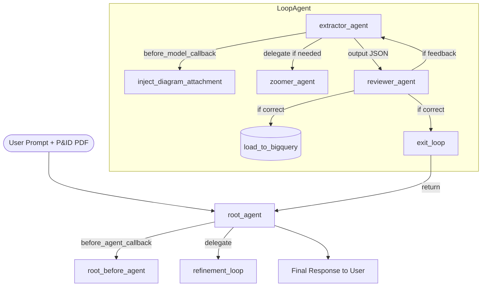

# P&ID Digitization Agent: Developer Reference Guide

This document provides a comprehensive overview of the **Pandid** multi-agent digitization system, covering its architecture, database structures, programmatic skill mappings, and quality evaluation flywheel.

---

## 1. Multi-Agent Orchestration Architecture

The system utilizes a stateful, graph-based workflow managed by ADK's `Workflow` and `LoopAgent` primitives. A user's query progresses through three primary execution phases:



### Core Execution Flow
1. **`setup_node` (Workflow Start)**: Captures user-attached schematics (PDF or images) from CLI executions, evaluations, or chat sessions. It registers the binary data as an ADK session artifact (`diagram.pdf`) and saves a local file replica.
2. **`refinement_loop` (Multi-Turn Collaboration)**: Coordinates the iterative extraction process up to 3 times:
   * **`extractor_agent`**: Reads the visual drawing, loads the engineering guidelines, and extracts structured nodes and connections.
   * **`reviewer_agent`**: Audits the generated JSON. If discrepancies are found, it provides specific, actionable feedback and loops back; if satisfied, it commits the graph data to BigQuery.
3. **`summarizer_agent` (Workflow End)**: Synthesizes the final response to the user, providing graph extraction statistics and practical graph query statements.

---

## 2. Advanced Vision & Skill Integration

### Multimodal Ingestion Callback (`inject_diagram_attachment`)
Rather than relying on fragile local file paths, the agent utilizes ADK's context-aware artifact service to dynamically bind visual drawings to the LLM's prompt window before inference. This callback is executed for both the `extractor_agent` and the `reviewer_agent`:

```python
async def inject_diagram_attachment(*args, **kwargs) -> None:
    """Callback to append the P&ID diagram PDF/Image to the model prompt."""
    ctx = kwargs.get("ctx") or args[0]
    request = kwargs.get("request") or args[1]

    # Dynamically load the stored schematic artifact
    part_obj = await ctx.load_artifact("diagram.pdf") or await ctx.load_artifact("diagram.png")
    
    if part_obj:
        # Avoid duplicate attachments
        if not any(is_visual_part(p) for content in request.contents for p in content.parts):
            # Inject the high-resolution file into the first user turn
            for content in request.contents:
                if content.role == "user" or not content.role:
                    content.parts.append(part_obj)
                    break
```

### Programmatic Skill Binding
To maintain a single source of truth, the engineering guidelines detailed in the external custom skill `pid-parsing-extraction/SKILL.md` are loaded programmatically during module initialization and dynamically appended to the agent prompts:

```python
# Programmatically bind custom skill instructions
skill_dir = pathlib.Path(__file__).parents[2] / "pid-parsing-extraction"
pid_skill = load_skill_from_dir(skill_dir)
skill_instructions = getattr(pid_skill, "instructions", "")

extractor_agent.instruction = f"{extractor_base_prompt}\n\n=== SKILL GUIDELINES ===\n{skill_instructions}"
reviewer_agent.instruction = f"{reviewer_base_prompt}\n\n=== SKILL GUIDELINES ===\n{skill_instructions}"
```

---

## 3. BigQuery Storage & Property Graph Querying

The pipeline structures extracted topologies into relational entities that are mapped into a physical **BigQuery Property Graph** to enable advanced topology querying.

### Entity Schemas
Data is partitioned by compound primary keys `(session_id, diagram_id, id)` to keep sessions isolated:

* **Nodes Table**: Stores equipment, instrumentation, and piping symbols.
* **Edges Table**: Maps physical connection lines, electrical loops, and signaling directions.

### Property Graph Definition (DDL)
Run the following statement inside BigQuery to create or update the graph:

```sql
CREATE OR REPLACE PROPERTY GRAPH `your_project.pandid.pandid_graph`
  NODE TABLES (
    `your_project.pandid.nodes`
      KEY (session_id, diagram_id, id)
      LABEL Node
      PROPERTIES (id, category, device_type, parameter, location, description)
  )
  EDGE TABLES (
    `your_project.pandid.edges`
      KEY (session_id, diagram_id, source_id, target_id, medium)
      SOURCE KEY (session_id, diagram_id, source_id) REFERENCES nodes (session_id, diagram_id, id)
      DESTINATION KEY (session_id, diagram_id, target_id) REFERENCES nodes (session_id, diagram_id, id)
      LABEL Connected_To
      PROPERTIES (medium, description)
  );
```

### Graph Matching Query Example (GQL)
Execute graph-based queries to trace connected pipelines or control loop paths:

```sql
SELECT * FROM BQ_QUERY_GRAPH(
  TABLE `your_project.pandid.pandid_graph`,
  'GRAPH_MATCH (eq:Node)-[e:Connected_To]->(val:Node)
   WHERE eq.category = "Equipment" AND val.category = "Valve"
   RETURN eq.id AS equipment_id, val.id AS valve_id, e.medium AS connection_medium'
);
```

---

## 4. The Quality Flywheel & Evaluation Setup

To continually measure and optimize the multi-agent extraction accuracy, use ADK's built-in evaluation harness.

### Key Evaluation Metrics
* **`collab_loop_trajectory_correctness`**: A custom metric that asserts the correct sequential execution of the multi-agent loop (verifying that the extractor completes its parsing before the reviewer audits and loads data to BigQuery).
* **`graph_extraction_accuracy`**: Calculates F1 precision and recall. It employs undirected connection matching via `frozenset` to ensure topological equivalence is scored correctly regardless of edge directionality.

### Interactive Iteration Commands
Run local evaluations and check regression metrics with these simple commands:

```bash
# 1. Synthesize new test cases (optional)
agents-cli eval dataset synthesize

# 2. Run the agents on the test dataset to generate traces
agents-cli eval generate

# 3. Grade the traces against the golden datasets
agents-cli eval grade

# 4. Compare current grade results with a previous baseline
agents-cli eval compare --baseline artifacts/grade_results/baseline.json --candidate artifacts/grade_results/candidate.json

# 5. Cluster and analyze grading failure modes
agents-cli eval analyze
```

---

## 5. Development Guidelines
- **Zero Import-Time Side Effects**: Never call network-connected or GCP-authenticating functions (like checking BigQuery tables) at global module scope. Keep all setups lazy.
- **Defensive Error Handling**: Always keep the Pydantic recovery blocks in `refinement_loop` to handle slightly imperfect model JSONs gracefully.
